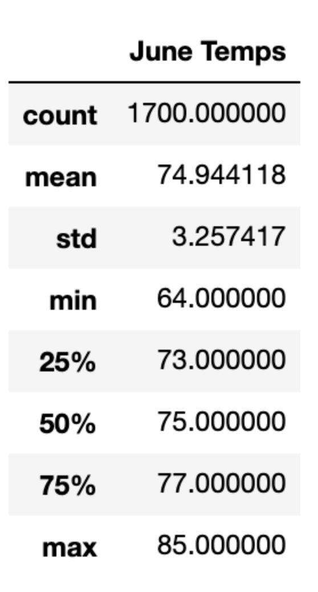
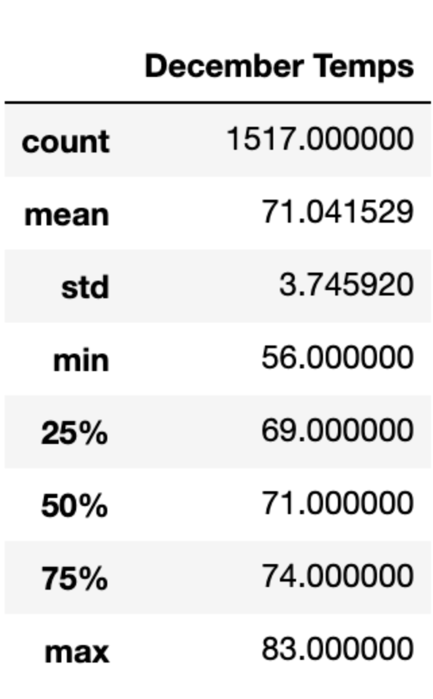

# Surfs Up

## Overview of the Analysis

The purpose of this project was to use SQLite and SQLAlchemy to gather temperature data from Oahu to determine if opening a surf and ice cream shop is sustainable year round.

## Results

- The average temperature does not change very much from June (74.9) to December (71.0)
- The highest temperature for both months only goes up to the mid-80s.
- Overall, the temperature during both months usually is around the 70s, with some range between the mid-60s and mid-80s.

## Summary

Overall, the results show that the temperature stays constant throughout the year and that opening a surf and ice cream shop could have some potential. Two queries I would do for more information would include any weather data (sunny, rain, etc.) or specific days to see if there are any days that are warmer/colder than others.
